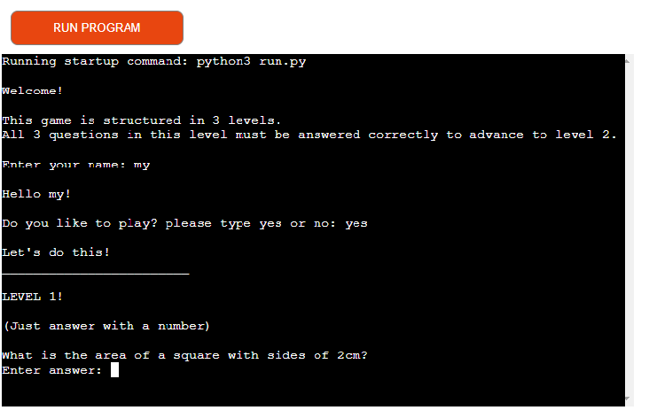

# The Quizgame

## Introduktion
This is a command-line game created with python for my Project portfolio 3 at Code Institute, Full-stack development program. 

The game is structured in 3 levels. If you pass the first level, you move on to the next, if you don't, you get more attempts. At the end, your results are compiled and saved to a google worksheet. The result is also printed out in the end of the game. So the player is able to se the results aswell.

* Link to app [Here](https://the-quizgame.herokuapp.com/)

### README Table Content
* [Indtroduktion](#introduktion)
* [User Stories](#user-stories)
* [Design](#design)
* [Flowcharts](#flowcharts)
* [Storage Data](#storage-data)
* [Technologies Used](#technologies-sed)
* [Programs Used](#programs-used)
* [Testing](#testing)
* [Deploying](#deploying)
* [Forking and Cloning](#forking-and-cloning)

### Game Features
* [Welcome/Intro](#welcome)
* [Level 1](#level-1)
* [Level 2](#level-2)
* [Level 3](#level-3)
* [Result](#result)

## User Stories 
* As a creator, I want to:
1. Build an easy app with python.
2. Build an app that is structered and easy to follow. 
3. Build an app that is easy but challenging. 

* As a visitor, i want to:
1. Enter the game with my name.
2. Be able to understand how to play the game. 
3. Be able to see my results so i can develop next time i play. 

## Design
* I have not imporded any colorama for colors since there where no time left for me to do that. But is it something to add to develop the app further in the feature. 
* The design thinking i did was that i clear the terminal when move to next levels. I think it looks less messy and the app is easier to follow. 

## Flowcharts:

* [Link to sheet:](https://docs.google.com/spreadsheets/d/1Y3-gufVw5YeNT0GoKhuRhtBzbFBTpEV2ubTGj8HOeBE/edit#gid=0)

## Game features:

### Welcome/Intro 
* Explains how the game works and asks you to fill in your name to play.

* When you have filled in your name, this will show.

* If you write no, goodbye.

* If any other, ValueError.

* If you write yes the game begin
### Level 1
* When you type yes the game will begin,
* Level one questions:

* When answer correct the score will add +1

* When answer wrong the wrong answer count will add +1

* If you fail you get another try and the questions run again.

### Level 2
* In this level you will guess a secret number between 0-15.

* You have 3 tries and if you guess wrong you get 3 more tries.

### Level 3
* In level 3 you can have minimun 0 score and max 3 score. Just one try here.

### Result
* When game is finished you can se your result and it will be saved to a google worksheet.

## Storage Data
I have used a Google sheet to save results every time the game is played. This sheet is connected to the code via Google Drive and Google Sheet API by Google Cloud Platform. This method allows me to send and save data. Since this is sensitive data, I had to add creds.json to the Git ignore file. This is so that it will not be pushed to github.

## Google sheet

* The goal is to have 0 failed tries in level 1 and 2, and the max score of 3 in level 3.

## Technologies Used:
* Python

### Python Packages
* [Gspread](https://pypi.org/project/gspread/): Allows communication with Google Sheets.
* [Google Auth](https://google-auth.readthedocs.io/en/stable/index.html): credentials used to validate credentials and grant access to Google service accounts.
* [import os](https://www.geeksforgeeks.org/clear-screen-python/): To clear the terminal

## Programs Used
* [GitPod](https://www.gitpod.io/): The prodject was created with Gitpod. 
* [GitHub](https://github.com/): 
With regular commit in the terminal the project is pushed to github where it is stored.
* [Heruko](https://dashboard.heroku.com/apps): Heroku was used to deploy the live project
* [PEP8 Validator](https://pep8ci.herokuapp.com/): The PEP8 validator was used to detect errors in the code.
* [Lucidchart](https://lucid.app/documents#/documents?folder_id=recent): Lucidchart was used to create the flowchart

## Testing 
No error was found after after handling error messages:

### Functionality
* The terminal has no issues and is working properly.
* The inputs for Name is working.
* The inputs for play yes/no working as it should. 
* The value error is working for input yes/no.
* The os.system('clear') is working to clear terminal.
* The game is running with no to long text, all text is displayed.
* The result in the end is calcutating as explected.
* The google worksheet is updating as expected.

## Bugs 

### Fixed bugs:
1. Print statements had errors of "Line to long ... > 79"
* Solution: made several shorter "my text" and add "+" between, "then the rest of text"
2. In the first level I got the game to work but only if I won on the first try. If I lost and got another try and won the second round I didn't progress to level 2 like I wanted. It was something with my break in the loop which did not work correctly.
* Solution: I made a play_game() function where i called the level_one() function instead of just at the end. I returned the boolean of you_win from the level_one to the run_game() function. And in the run_game function i put the "break" when you_win = True. 
3. 
I created an empty list to store the results after each round. I wrote: final_result.append(number_of_failures_level_1) in my else: within my play_game() function.
* Solution: I moved my append code just one step up in code, to "if you_win_level_one".

## Deploying 
1. Log in at [Heroku](https://dashboard.heroku.com/apps) and create an account. 
2. Click create new app at the top right of page.
3. You need to call your project something uniq, it can't be a name that already exist.
4. Select your region.
5. Click create App
6.  Click on the Settings Tab and scroll down to Config Vars. 
7. Click Reveal Config Vars and enter port into the Key box and 8000 into the Value box and click the Add button.
8. Click Reveal Config Vars again and enter CREDS into the Key and paste in your requrement.txt file in value box. 
9. Add python and node.js for your Buildpack. 
10. Scroll to the top of the page and choose the Deploy tab.
11. Select Github as deployment method.
12. Confirm you want to connect.
13. Search for the repository name and click the connect button.
14. Select either Enable Automatic or Manual deployment when you push updates to github. 

## Forking and Cloning 
### Fork this project:
1. Open GitHub
2. Click on the project to be forked
3. Find the Fork button at the top right of the page
4. Once you click the button the fork will be in your repository.
### Clone this project:
1. Log in or sign up to GitHub.
2. Go to the repository for this project: [The Quizgame](#the-quizgame)
3. Click on the code button, select whether you would like to clone with HTTPS, SSH or GitHub CLI and copy the link shown.
4. Open the terminal in your code editor and change the current working directory to the location you want to use for the cloned directory.
5. Type 'git clone' into the terminal and then paste the link you copied in step 3 and press enter.

## Credits 

### content:
* The idea for the project is my own. With inspiration and help from love sandwiches and youtube videos like:
* https://www.youtube.com/watch?v=zehwgTB0vV8&t=480s
* https://www.youtube.com/watch?v=B9ORjeQlPOA
* 

### Sources
* [Stack Overflow](https://stackoverflow.com/)
* [W3Schools - Python](https://www.w3schools.com/python/)

### Special thanks to:
* My trusty and kind mentor Martina Terlevic.
* Wondeful help from Tutor support.

